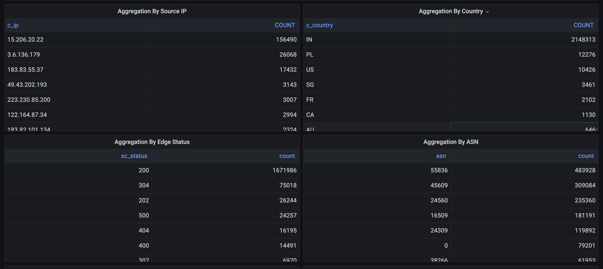

# CloudFront Realtime logs to External Data Store

This project provides a data ingestion pipeline that reads data from AWS Kinesis and writes it to a ClickHouse or ElasticSearch.


## Dashboards View On Grafana
### Map View


### Table View 


We use aggregated View to Analyse traffic pattern based on Source IPs, ASN, Hosts, User Agents, Country.

This view empower Licious's WAF (Web Application Firewal) system detecting and blocking possible attacks.

## Configuring Realtime Logs of CloudFront on AWS Console

Following are the supported fields configured on `com.licious.cflogprocessor.formatter.CloudfrontLogEntry`.
We found other fields redundant to our use case. But if required `CloudfrontLogEntry` and `CloudfrontLogEntrySerializer` Class can be configured for other fields.


## AWS Supported Docs
- https://aws.amazon.com/blogs/networking-and-content-delivery/cloudfront-realtime-logs/
- https://docs.aws.amazon.com/AmazonCloudFront/latest/DeveloperGuide/real-time-logs.html

-----------------------------------
## Table of Contents

- [Prerequisites](#prerequisites)
- [Setup](#setup)
- [Configuration](#configuration)
- [Running the Application](#running-the-application)
- [Error Handling](#error-handling)
- [Testing and Validation](#testing-and-validation)
- [Contributing](#contributing)
- [License](#license)
- [Additional Files](#additional-files)


## Prerequisites

Before you begin, ensure you have the following installed:

- Java Development Kit (JDK) 11 or higher
- Apache Maven
- Docker
- Kubernetes (Minikube or any other Kubernetes setup)
- AWS CLI (configured with appropriate permissions for accessing Kinesis)

## Setup

1. **Clone the repository:**

   ```bash
   git clone https://github.com/LiciousTech/awscf-realtime-logs-analytics.git
   cd awscf-realtime-logs-analytics
   ```

2. **Build the project:**

   ```bash
   mvn clean install
   ```

3. **Dockerize the application:**

   ```bash
   docker build -t yourusername/awscf-realtime-logs-analytics:latest .
   ```

4. **Deploy ClickHouse on Kubernetes:**

   To deploy ClickHouse on Kubernetes using Helm, follow the [official documentation](https://clickhouse.tech/docs/en/operations/kubernetes/) provided by ClickHouse.

## Environment Variables

### Configure DataStore Writer :

Supported Values `CLICKHOUSE`, `ELASTICSEARCH`, or `STDOUT`.

```properties
WRITER_DESTINATION_DATASOURCE: "CLICKHOUSE"
```


### Configure ClickHouse connection:

```properties
WRITER_DATASOURCE_CLICKHOUSE_URL: "jdbc:clickhouse://<your-clickhouse-host>:8123"
WRITER_DATASOURCE_CLICKHOUSE_USER: "admin"
WRITER_DATASOURCE_CLICKHOUSE_PASSWORD: "changeme"
```

### Configure ElasticSearch connection:

```properties
WRITER_DATASOURCE_ES_HOST: "localhost"
WRITER_DATASOURCE_ES_PORT: "9200"
WRITER_DATASOURCE_ES_SCHEME: "http"
```

### Configure AWS Kinesis:

```properties
AWS_KINESIS_STREAM_NAME: <your-stream-name>
AWS_KINESIS_APPLICATION_NAME: <your-app-name>
```


### ClickHouse Schema

Create the necessary tables in your ClickHouse cluster using the following schema:

MergeTree Engine
```sql
-- cloudfront_logs.cloudfront_logs definition

CREATE TABLE cloudfront_logs.cloudfront_logs
(
    `timestamp` UInt64,
    `c_ip` String,
    `time_to_first_byte` Float32,
    `sc_status` Int32,
    `sc_bytes` UInt64,
    `cs_method` String,
    `cs_protocol` String,
    `cs_host` String,
    `cs_uri_stem` String,
    `cs_bytes` UInt64,
    `x_edge_location` String,
    `x_host_header` String,
    `cs_protocol_version` String,
    `c_ip_version` String,
    `cs_user_agent` String,
    `cs_referer` String,
    `cs_uri_query` String,
    `x_edge_response_result_type` String,
    `x_forwarded_for` String,
    `ssl_protocol` String,
    `x_edge_result_type` String,
    `sc_content_type` String,
    `c_country` String,
    `cs_accept_encoding` String,
    `cs_accept` String,
    `cache_behavior_path_pattern` String,
    `primary_distribution_id` String,
    `asn` UInt64
)
ENGINE = MergeTree
ORDER BY timestamp
```

Here moving_from_hot_to_cold is our custom storage policy which moves data older that 3 days to s3 to 
Distributed version for having multiple shards:
```sql
-- cloudfront_logs.distributed_cloudfront_logs definition

CREATE TABLE cloudfront_logs.distributed_cloudfront_logs
(
    `timestamp` UInt64,
    `c_ip` String,
    `time_to_first_byte` Float32,
    `sc_status` Int32,
    `sc_bytes` UInt64,
    `cs_method` String,
    `cs_protocol` String,
    `cs_host` String,
    `cs_uri_stem` String,
    `cs_bytes` UInt64,
    `x_edge_location` String,
    `x_host_header` String,
    `cs_protocol_version` String,
    `c_ip_version` String,
    `cs_user_agent` String,
    `cs_referer` String,
    `cs_uri_query` String,
    `x_edge_response_result_type` String,
    `x_forwarded_for` String,
    `ssl_protocol` String,
    `x_edge_result_type` String,
    `sc_content_type` String,
    `c_country` String,
    `cs_accept_encoding` String,
    `cs_accept` String,
    `cache_behavior_path_pattern` String,
    `primary_distribution_id` String,
    `asn` UInt64
)
ENGINE = Distributed('cluster_name', 'database_name', 'local_table_name', cityHash64(timestamp));
```

### Elasticsearch Mapping

If you are also indexing data into Elasticsearch, create the necessary index with the provided mapping.

```json
PUT /cloudfrontlogs
{
   "settings": {
      "number_of_shards": 5,
      "number_of_replicas": 1
   },
   "mappings": {
      "properties": {
         "timestamp": {
            "type": "date",
            "format": "epoch_second"
         },
         "c_ip": {
            "type": "ip"
         },
         "time_to_first_byte": {
            "type": "float"
         },
         "sc_status": {
            "type": "integer"
         },
         "sc_bytes": {
            "type": "integer"
         },
         "cs_method": {
            "type": "keyword"
         },
         "cs_protocol": {
            "type": "keyword"
         },
         "cs_host": {
            "type": "keyword"
         },
         "cs_uri_stem": {
            "type": "keyword"
         },
         "cs_bytes": {
            "type": "integer"
         },
         "x_edge_location": {
            "type": "keyword"
         },
         "x_host_header": {
            "type": "keyword"
         },
         "cs_protocol_version": {
            "type": "keyword"
         },
         "c_ip_version": {
            "type": "keyword"
         },
         "cs_user_agent": {
            "type": "text",
            "fields": {
               "keyword": {
                  "type": "keyword",
                  "ignore_above": 256
               }
            }
         },
         "cs_referer": {
            "type": "text",
            "fields": {
               "keyword": {
                  "type": "keyword",
                  "ignore_above": 256
               }
            }
         },
         "cs_uri_query": {
            "type": "text",
            "fields": {
               "keyword": {
                  "type": "keyword",
                  "ignore_above": 256
               }
            }
         },
         "x_edge_response_result_type": {
            "type": "keyword"
         },
         "x_forwarded_for": {
            "type": "keyword"
         },
         "ssl_protocol": {
            "type": "keyword"
         },
         "x_edge_result_type": {
            "type": "keyword"
         },
         "sc_content_type": {
            "type": "keyword"
         },
         "c_country": {
            "type": "keyword"
         },
         "cs_accept_encoding": {
            "type": "keyword"
         },
         "cs_accept": {
            "type": "keyword"
         },
         "cache_behavior_path_pattern": {
            "type": "keyword"
         },
         "primary_distribution_id": {
            "type": "keyword"
         },
         "asn": {
            "type": "keyword"
         }
      }
   }
}
```
## Running the Application

1. **Deploy the application on Kubernetes:**

   ```bash
   kubectl apply -f app-deployment.yaml
   ```

2. **Monitor the application:**

   Check the logs of the running pods to ensure the application is processing data correctly:

   ```bash
   kubectl logs -f <your-pod-name>
   ```

## Error Handling

The application includes error handling mechanisms to manage common issues in distributed environments. If an error occurs during data ingestion, the application will log the error and attempt to retry the operation. Ensure that the ClickHouse cluster has enough resources (CPU, memory, and disk space) to handle the data load.

## Testing and Validation

### Unit Tests

Run the unit tests to ensure the core logic of the application is functioning correctly:

```bash
mvn test
```

### Integration Tests

Deploy the application in a test environment and validate that data is being ingested into the ClickHouse cluster correctly. Use ClickHouse's query interface to check the distribution and accuracy of the ingested data.

## Contributing

Contributions are welcome! Please fork the repository and create a pull request with your changes. Ensure that your code adheres to the project's coding standards and includes appropriate tests.

## License

This project is licensed under the MIT License. See the [LICENSE](./LICENSE) file for details.

## Additional Files

- **app-deployment.yaml**: Configuration for deploying the data ingestion application.
- **application.properties**: Configuration file for ClickHouse connection details.
- **kinesis.properties**: Configuration file for AWS Kinesis stream details.

Feel free to customize this README file as needed to match your specific project setup and requirements.
